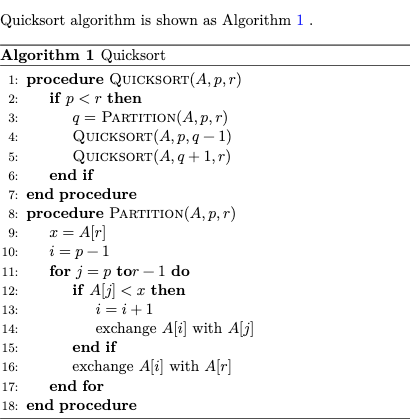

# Quarto Pseudocode Extension


---

🇺🇸 [README](README.md) | 🇨🇳 [中文说明](README.zh.md)

A Quarto extension to render pseudocode for `html` and `pdf` format output. It's based on [pseudocode.js](https://github.com/SaswatPadhi/pseudocode.js) for `html` format, `algorithm` and `algpseudocode` package for `pdf` format.

## Installing

```bash
quarto add leovan/quarto-pseudocode
```

This will install the extension under the `_extensions` subdirectory. If you're using version control, you will want to check in this directory.

## Using

Put this in the header of your document, or in the `_quarto.yml` file.

```yml
filters:
  - pseudocode
```

Then you can put the pseudocode in a code block marked with `pseudocode`.

````
```pseudocode
#| label: alg-quicksort
#| html-indent-size: "1.2em"
#| html-comment-delimiter: "//"
#| html-line-number: true
#| html-line-number-punc: ":"
#| html-no-end: false
#| pdf-placement: "htb!"
#| pdf-line-number: true

\begin{algorithm}
\caption{Quicksort}
\begin{algorithmic}
\Procedure{Quicksort}{$A, p, r$}
  \If{$p < r$}
    \State $q = $ \Call{Partition}{$A, p, r$}
    \State \Call{Quicksort}{$A, p, q - 1$}
    \State \Call{Quicksort}{$A, q + 1, r$}
  \EndIf
\EndProcedure
\Procedure{Partition}{$A, p, r$}
  \State $x = A[r]$
  \State $i = p - 1$
  \For{$j = p$ \To $r - 1$}
    \If{$A[j] < x$}
      \State $i = i + 1$
      \State exchange
      $A[i]$ with     $A[j]$
    \EndIf
    \State exchange $A[i]$ with $A[r]$
  \EndFor
\EndProcedure
\end{algorithmic}
\end{algorithm}
```
````

> **Note**  
> Use upper camel case format keyword rather than all uppercase format keyword.

Use `@<alg-label>` to do cross reference.

```
Quicksort algorithm is shown as @alg-quicksort.
```

> **Note**  
> For `book` type project, cross reference in different files is only available with `pdf` format.

Pseudocode and cross reference rendered in `html` and `pdf` format are shown as below.

| `html` format                    | `pdf` format                    |
| :------------------------------: | :-----------------------------: |
|  |  |

Options for pseudocode share the same format like R or Python code.

| option                   | default  | format | comment                                                  |
| :----------------------- | :------- | :----- | :------------------------------------------------------- |
| `label`                  |          | all    | label for cross reference, must start with `alg-` if has |
| `html-indent-size`       | "1.2 em" | `html` | `indentSize` in pseudocode.js                            |
| `html-comment-delimiter` | "//"     | `html` | `commentDelimiter` in pseudocode.js                      |
| `html-line-number`       | true     | `html` | `lineNumber` in pseudocode.js                            |
| `html-line-number-punc`  | ":"      | `html` | `lineNumberPunc`in pseudocode.js                         |
| `html-no-end`            | false    | `html` | `noEnd` in pseudocode.js                                 |
| `pdf-placement`          |          | `pdf`  | placement of the pseudocode in text                      |
| `pdf-line-number`        | true     | `pdf`  | show line number                                         |

> **Note**  
> If set the placement in pseudocode, such as `\begin{algorithm}[htb!]`, then `pdf-placement` option will be ignored.  
> If set show line number or not in pseudocode, such as `\begin{algorithmic}[1]`, then `pdf-line-number` option will be ignored.  
> All these changes won't affect the output of `html` format. We recommend you use options rather than modify pseudocode directly.

For `html` format:

[pseudocode.js](https://github.com/SaswatPadhi/pseudocode.js) render math formulas using either [KaTeX](https://katex.org/) or [MathJax](https://www.mathjax.org/). We add [pseudocode.js](https://github.com/SaswatPadhi/pseudocode.js) after html body, thus you need initialize [KaTeX](https://katex.org/) or [MathJax](https://www.mathjax.org/) before html body or in html header.

For example, you can put this in the header of your document, or in the `_quarto.yml` file.

```yml
format:
  html:
    include-in-header:
      text: |
        <script>
        MathJax = {
          loader: {
            load: ['[tex]/boldsymbol']
          },
          tex: {
            tags: "all",
            inlineMath: [['$','$'], ['\\(','\\)']],
            displayMath: [['$$','$$'], ['\\[','\\]']],
            processEscapes: true,
            processEnvironments: true,
            packages: {
              '[+]': ['boldsymbol']
            }
          }
        };
        </script>
        <script src="https://cdn.jsdelivr.net/npm/mathjax@3/es5/tex-chtml-full.js" type="text/javascript"></script>
```

For `pdf` format:

1. `\numberwithin{algorithm}{chapter}` will add chapter level before pseudocode caption in `book` type project, like `x.n` in chapter `x`.
2. `\algrenewcommand{\algorithmiccomment}[1]{<your value> #1}` will change the form in witch comments are displayed.

Put these in the header of your document, or in the `_quarto.yml` file.

```yml
format:
  pdf:
    include-before-body:
      text: |
        \numberwithin{algorithm}{chapter}
        \algrenewcommand{\algorithmiccomment}[1]{\hskip3em$\rightarrow$ #1}
```

You can change the `Algorithm` word to native language, such as `算法` in Chinese, by putting this in the header of your document, or in the `_metadata.yml` file.

```yml
pseudocode:
  alg-title: "算法"
  alg-prefix: "算法"
```

`alg-title` is used for pseudocode caption and `alg-prefix` is used for cross reference.

## Examples

1. Single document (HTML and PDF): [examples/simple/simple.qmd](examples/simple/simple.qmd).
2. Book document (HTML and PDF): [examples/book/_quarto.yml](examples/book/_quarto.yml).
3. Beamer document (PDF): [examples/beamer/beamer.qmd](examples/beamer/beamer.qmd).

## License

The MIT License (MIT)

Copyright (c) 2023-2024 [范叶亮 | Leo Van](https://leovan.me)
