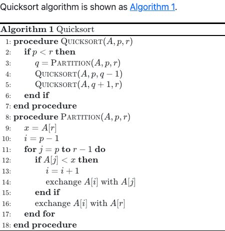
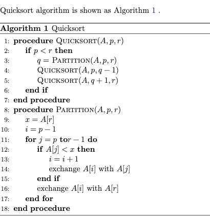

# Quarto Pseudocode Extension


---

🇺🇸 [README](README.md) | 🇨🇳 [中文说明](README.zh.md)

A Quarto extension to render pseudocode for HTML and PDF document. It's based on [pseudocode.js](https://github.com/SaswatPadhi/pseudocode.js) for HTML document, `algorithm` and `algpseudocodex` package for PDF document.

## Installing

```bash
quarto add leovan/quarto-pseudocode
```

This will install the extension under the `_extensions` subdirectory. If you're using version control, you will want to check in this directory.

## Using

### Adding Extension

Add this in the header of your document, or in the `_quarto.yml` file:

```yml
filters:
  - pseudocode
```

### Pseudocode Block

Add the pseudocode in a code block marked with `pseudocode`:

````
```pseudocode
#| html-indent-size: "1.2em"
#| html-comment-delimiter: "//"
#| html-line-number: true
#| html-line-number-punc: ":"
#| html-no-end: false
#| pdf-placement: "htb!"
#| pdf-line-number: true
#| pdf-comment-delimiter: "//"

\begin{algorithm}
\caption{Quicksort}
\begin{algorithmic}
\Procedure{Quicksort}{$A, p, r$}
  \If{$p < r$}
    \State $q = $ \Call{Partition}{$A, p, r$}
    \State \Call{Quicksort}{$A, p, q - 1$}
    \State \Call{Quicksort}{$A, q + 1, r$}
  \EndIf
\EndProcedure
\Procedure{Partition}{$A, p, r$}
  \State $x = A[r]$
  \State $i = p - 1$
  \For{$j = p$ \To $r - 1$}
    \If{$A[j] < x$}
      \State $i = i + 1$
      \State exchange
      $A[i]$ with     $A[j]$
    \EndIf
    \State exchange $A[i]$ with $A[r]$
  \EndFor
\EndProcedure
\end{algorithmic}
\end{algorithm}
```
````

> [!IMPORTANT]
> Use upper camel case format keyword rather than all uppercase format keyword.

### Parameters

Global parameters are show as below:

| Parameter          | Default     | Format | Description                                      |
| ------------------ | ----------- | ------ | ------------------------------------------------ |
| `caption-prefix`   | "Algorithm" | ALL    | Prefix used for generated pseudocode captions.   |
| `reference-prefix` | "Algorithm" | ALL    | Prefix used for pseudocode cross-reference text. |
| `caption-number`   | true        | ALL    | Show numbering in pseudocode captions.           |
| `caption-align`    | "left"      | ALL    | Alignment for pseudocode captions.               |

Add global parameters in the header of your document, or in the `_quarto.yml` file:

```yml
pseudocode:
  caption-prefix: "Algorithm"
  reference-prefix: "Algorithm"
  caption-number: true
  caption-align: "left"
```

Parameters for pseudocode share the same format like R or Python code:

| Parameter                | Default | Format | Description                                            |
| ------------------------ | ------- | ------ | ------------------------------------------------------ |
| `label`                  |         | ALL    | Cross-reference label, typically starting with `alg-`. |
| `html-indent-size`       | "1.2em" | HTML   | HTML indent size for pseudocode.js output.             |
| `html-comment-delimiter` | "//"    | HTML   | HTML comment delimiter token.                          |
| `html-line-number`       | true    | HTML   | Show line numbers in HTML output.                      |
| `html-line-number-punc`  | ":"     | HTML   | Punctuation used after line numbers in HTML output.    |
| `html-no-end`            | false   | HTML   | Hide end statements in HTML output.                    |
| `html-indent-lines`      | false   | HTML   | Show indent guide lines in HTML output.                |
| `pdf-placement`          | "H"     | PDF    | LaTeX algorithm placement token in PDF output.         |
| `pdf-line-number`        | true    | PDF    | Show line numbers in PDF output.                       |
| `pdf-comment-delimiter`  | "//"    | PDF    | Comment delimiter token in PDF output.                 |
| `pdf-no-end`             | false   | PDF    | Hide end statements in PDF output.                     |
| `pdf-indent-lines`       | false   | PDF    | Show indent guide lines in PDF output.                 |
| `pdf-italic-comment`     | false   | PDF    | Italic comments in PDF output.                         |
| `pdf-right-comment`      | false   | PDF    | Right justified comments in PDF output.                |
| `pdf-comment-color`      | "black" | PDF    | Color of the comments in PDF output.                   |

> [!NOTE]
>
> 1. If set the placement in pseudocode, such as `\begin{algorithm}[htb!]`, then `pdf-placement` option will be ignored.
> 2. If set show line number or not in pseudocode, such as `\begin{algorithmic}[1]`, then `pdf-line-number` option will be ignored.
> 3. All these changes won't affect the output of HTML document. We recommend you set the parameters rather than modify pseudocode directly.

For HTML document, [pseudocode.js](https://github.com/SaswatPadhi/pseudocode.js) render math formulas using either [KaTeX](https://katex.org/) or [MathJax](https://www.mathjax.org/). We add [pseudocode.js](https://github.com/SaswatPadhi/pseudocode.js) after html body, thus you need initialize [KaTeX](https://katex.org/) or [MathJax](https://www.mathjax.org/) before html body or in html header. Add this in the header of your document, or in the `_quarto.yml` file.

#### MathJax 3

```yml
format:
  html:
    include-in-header:
      text: |
        <script>
        MathJax = {
          loader: {
            load: ["[tex]/boldsymbol"],
          },
          tex: {
            tags: "all",
            inlineMath: [["$", "$"], ["\\(", "\\)"]],
            displayMath: [["$$", "$$"], ["\\[", "\\]"]],
            processEscapes: true,
            processEnvironments: true,
            packages: {
              "[+]": ["boldsymbol"],
            },
          },
        };
        </script>
        <script type="text/javascript" src="https://cdn.jsdelivr.net/npm/mathjax@3/es5/tex-chtml-full.js"></script>
```

#### MathJax 4

```yml
format:
  html:
    include-in-header:
      text: |
        <script>
        MathJax = {
          loader: {
            load: ["[tex]/boldsymbol"],
          },
          tex: {
            tags: "all",
            inlineMath: [["$", "$"], ["\\(", "\\)"]],
            displayMath: [["$$", "$$"], ["\\[", "\\]"]],
            processEscapes: true,
            processEnvironments: true,
            packages: {
              "[+]": ["boldsymbol"],
            },
          },
        };
        </script>
        <script type="text/javascript" src="https://cdn.jsdelivr.net/npm/mathjax@4/tex-chtml.js"></script>
```

#### KaTeX

```yml
format:
  html:
    include-in-header:
      text: |
      <link rel="stylesheet" href="https://cdn.jsdelivr.net/npm/katex@latest/dist/katex.min.css" />
      <script type="text/javascript" src="https://cdn.jsdelivr.net/npm/katex@latest/dist/katex.min.js"></script>
```

For PDF document, pseudocode caption in `book` type project will be changed from `Algorithm n` to `Algorithm x.n` in chapter `x`. Add `\algrenewcommand{\algorithmiccomment}[1]{<your value> #1}` in the header of your document, or in the `_quarto.yml` file will change the form in which comments are displayed:

```yml
format:
  pdf:
    include-before-body:
      text: |
        \algrenewcommand{\algorithmiccomment}[1]{\hskip3em$\rightarrow$ #1}
```

### Cross Reference

#### Build-in Cross Reference

Set the `label` in pseudocode, and it must start with `algo-`:

> [!WARNING]
> From Quarto 1.8, `alg` has become a reserved cross reference prefix keyword.

````
```pseudocode
#| label: algo-quicksort
...

\begin{algorithm}
\caption{Quicksort}
\begin{algorithmic}
...
\end{algorithmic}
\end{algorithm}
```
````

Use `@<label>` to do cross reference:

```
Quicksort algorithm is shown as @algo-quicksort.
```

> [!IMPORTANT]
> Must set `label` and `\caption{}` to make build-in cross reference works.

> [!WARNING]
> For `book` type project, build-in cross reference in different files works only with PDF format.

#### Quarto Custom Cross Reference

Add custom cross reference for pseudocode in the header of your document, or in the `_quarto.yml` file:

```yaml
crossref:
  custom:
    - kind: float
      key: alg
      reference-prefix: "Algorithm"
      caption-prefix: "Algorithm"
      latex-env: alg
      latex-list-of-description: Algorithm
```

Use [Quarto custom cross reference](https://quarto.org/docs/authoring/cross-references-custom.html) to surround the pseudocode:

````
::: {#alg-quicksort}

```pseudocode
...

\begin{algorithm}
\caption{Quicksort}
\begin{algorithmic}
...
\end{algorithmic}
\end{algorithm}
```

Quicksort

:::
````

> [!IMPORTANT]
>
> 1. Do not set `label` to avoid conflict with build-in cross reference.
> 2. Set the global parameter `caption-number` to `false` to avoid show different numbers in pseudocode build-in caption and Quarto cross reference caption.
> 3. Set both captions in pseudocode and Quarto custom cross reference to achieve best effect.

Use `@<label>` to do cross reference.

```
Quicksort algorithm is shown as @alg-quicksort.
```

#### Difference

1. Quarto custom cross reference will add an extra caption like figure, in which number may not be same as pseudocode build-in caption.
2. Build-in cross reference in different files is only available with PDF document for `book` type project. Quarto custom cross reference works in both HTML and PDF document.

Now, expect cross reference in different files with PDF document for `book` type project, we strongly recommend use build-in cross reference to achieve best effect.

> [!CAUTION]
> Do not use different type of cross reference in the same project.

## Examples

Pseudocode and cross reference rendered in HTML and PDF document are shown as below.


|          HTML document          |          PDF document          |
| :----------------------------------: | :---------------------------------: |
|  |  |

More examples please refer:

1. Single document (HTML and PDF): [examples/simple](examples/simple).
2. Book document (HTML and PDF): [examples/book](examples/book).
3. Beamer document (PDF): [examples/beamer](examples/beamer).
4. Cross reference example (HTML and PDF): [examples/cross-reference](examples/cross-reference).

## License

The MIT License (MIT)

Copyright (c) 2023-2026 [范叶亮 | Leo Van](https://leovan.me)
