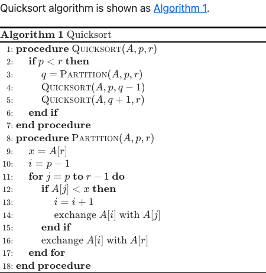
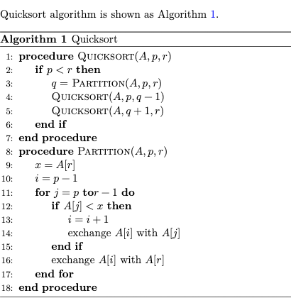

# Quarto 伪代码扩展


---

🇺🇸 [README](README.md) | 🇨🇳 [中文说明](README.zh.md)

一个用于在 `html` 和 `pdf` 文档中渲染伪代码的 Quarto 扩展。`html` 文档基于 [pseudocode.js](https://github.com/SaswatPadhi/pseudocode.js) 实现，`pdf` 文档基于 `algorithm` 和 `algorithmicx` 包实现。

## 安装

```bash
quarto add leovan/quarto-pseudocode
```

这将在 `_extensions` 子目录中安装本插件。如果使用版本控制，请检入到此目录。

## 使用

### 添加扩展

将如下内容添加到文档的头部或 `_quarto.yml` 文件中：

```yml
filters:
  - pseudocode
```

### 伪代码块

将伪代码添加到标记为 `pseudocode` 的代码块中：

````
```pseudocode
#| html-indent-size: "1.2em"
#| html-comment-delimiter: "//"
#| html-line-number: true
#| html-line-number-punc: ":"
#| html-no-end: false
#| pdf-placement: "htb!"
#| pdf-line-number: true

\begin{algorithm}
\caption{Quicksort}
\begin{algorithmic}
\Procedure{Quicksort}{$A, p, r$}
  \If{$p < r$}
    \State $q = $ \Call{Partition}{$A, p, r$}
    \State \Call{Quicksort}{$A, p, q - 1$}
    \State \Call{Quicksort}{$A, q + 1, r$}
  \EndIf
\EndProcedure
\Procedure{Partition}{$A, p, r$}
  \State $x = A[r]$
  \State $i = p - 1$
  \For{$j = p$ \To $r - 1$}
    \If{$A[j] < x$}
      \State $i = i + 1$
      \State exchange
      $A[i]$ with     $A[j]$
    \EndIf
    \State exchange $A[i]$ with $A[r]$
  \EndFor
\EndProcedure
\end{algorithmic}
\end{algorithm}
```
````

> [!IMPORTANT]
> 使用大驼峰式关键词，而非全大写关键词。

### 参数配置

全局参数如下：

| 参数               | 默认值      | 格式 | 注释                                    |
| ------------------ | ----------- | ---- | --------------------------------------- |
| `caption-prefix`   | "Algorithm" | 全部 | 标题前缀                                |
| `reference-prefix` | "Algorithm" | 全部 | 引用前缀                                |
| `caption-number`   | true        | 全部 | 显示内置标题数字                        |
| `caption-align`    | "left"      | 全部 | 标题对齐方式，"left"、"center"或"right" |

将参数添加到文档的头部或 `_metadata.yml` 文件中，例如：

```yml
pseudocode:
  caption-prefix: "算法"
  reference-prefix: "算法"
  caption-number: true
  caption-align: "left"
```

伪代码参数格式类似 R 和 Python 代码，如下：

| 参数                     | 默认值  | 格式   | 注释                                     |
| ------------------------ | ------- | ------ | ---------------------------------------- |
| `label`                  |         | 全部   | 用于引用的标签，如果有必须以 `alg-` 开头 |
| `html-indent-size`       | "1.2em" | `html` | pseudocode.js 中的 `indentSize`          |
| `html-comment-delimiter` | "//"    | `html` | pseudocode.js 中的 `commentDelimiter`    |
| `html-line-number`       | true    | `html` | pseudocode.js 中的 `lineNumber`          |
| `html-line-number-punc`  | ":"     | `html` | pseudocode.js 中的 `lineNumberPunc`      |
| `html-no-end`            | false   | `html` | pseudocode.js 中的 `noEnd`               |
| `pdf-placement`          | "H"     | `pdf`  | 伪代码在文本中的放置方式                 |
| `pdf-line-number`        | true    | `pdf`  | 是否显示行号                             |

> [!NOTE]
>
> 1. 如果在伪代码块中直接指定方式方式，例如 `\begin{algorithm}[htb!]`，则 `pdf-placement` 参数将被忽略。
> 2. 如果在伪代码块中直接指定是否显示行号，例如 `\begin{algorithmic}[1]`，则 `pdf-line-number` 参数将被忽略。
> 3. 所有这些改变不会影响 `html` 文档，建议使用参数选项而非直接修改伪代码。

对于 `html` 文档，[pseudocode.js](https://github.com/SaswatPadhi/pseudocode.js) 使用 [KaTeX](https://katex.org/) 或 [MathJax](https://www.mathjax.org/) 渲染数学公式。本扩展在 html body 之后添加 [pseudocode.js](https://github.com/SaswatPadhi/pseudocode.js)，因此你需要在 html body 之前或 html header 中初始化 [KaTeX](https://katex.org/) 或 [MathJax](https://www.mathjax.org/)。将相关内容添加到文档的头部或 `_quarto.yml` 文件中：

```yml
format:
  html:
    include-in-header:
      text: |
        <script>
        MathJax = {
          loader: {
            load: ['[tex]/boldsymbol']
          },
          tex: {
            tags: "all",
            inlineMath: [['$','$'], ['\\(','\\)']],
            displayMath: [['$$','$$'], ['\\[','\\]']],
            processEscapes: true,
            processEnvironments: true,
            packages: {
              '[+]': ['boldsymbol']
            }
          }
        };
        </script>
        <script src="https://cdn.jsdelivr.net/npm/mathjax@3/es5/tex-chtml-full.js" type="text/javascript"></script>
```

对于 `pdf` 文档，在 `book` 类型项目中将第 `x` 章中伪代码标题序号将由 `Algorithm n` 变为 `Algorithm x.n`。将 `\algrenewcommand{\algorithmiccomment}[1]{<your value> #1}` 添加到文档的头部或 `_quarto.yml` 文件中可以改变注释的显示方式：

```yml
format:
  pdf:
    include-before-body:
      text: |
        \algrenewcommand{\algorithmiccomment}[1]{\hskip3em$\rightarrow$ #1}
```

### 交叉引用

#### 内置交叉引用

在伪代码块中设置 `label`，并且需要以 `algo-` 开头：

> [!WARNING]
> 从 Quarto 1.8 开始，`alg` 已经成为交叉引用的保留前缀。

````
```pseudocode
#| label: algo-quicksort
...

\begin{algorithm}
\caption{Quicksort}
\begin{algorithmic}
...
\end{algorithmic}
\end{algorithm}
```
````

在正文中使用 `@<label>` 进行交叉引用：

```
Quicksort algorithm is shown as @algo-quicksort.
```

> [!IMPORTANT]
> 必须设置 `label` 和 `\caption{}` 以确保内置交叉引用正常。

> [!WARNING]
> 对于 `book` 类型项目，跨文件引用仅在 `pdf` 文档中可用。

#### Quarto 自定义交叉引用

在文档的头部或 `_quarto.yml` 文件中定义用于伪代码的自定义交叉引用：

```yaml
crossref:
  custom:
    - kind: float
      key: alg
      reference-prefix: "Algorithm"
      caption-prefix: "Algorithm"
      latex-env: alg
      latex-list-of-description: Algorithm
```

使用 [Quarto 自定义交叉引用](https://quarto.org/docs/authoring/cross-references-custom.html) 包围伪代码块：

````
::: {#alg-quicksort}

```pseudocode
...

\begin{algorithm}
\caption{Quicksort}
\begin{algorithmic}
...
\end{algorithmic}
\end{algorithm}
```

Quicksort

:::
````

> [!IMPORTANT]
>
> 1. 请勿设置 `label`，以避免与内置引用冲突。
> 2. 请将全局设置 `caption-number` 置为 `false`，以避免在伪代码内置标题和 Quarto 自定义交叉引用标题中显式不一致的数字。
> 3. 在伪代码块和 Quarto 自定义交叉引用中同时设置标题以取得最佳效果。

在正文中使用 `@<label>` 进行交叉引用：

```
Quicksort algorithm is shown as @alg-quicksort.
```

### 区别

1. Quarto 自定义交叉引用会额外添加一个类似图片的标题，并且其中的数字和伪代码内置标题中的数字可能不一致。
2. 对于 `book` 类型项目，内置交叉引用跨文件引用仅在 `pdf` 文档中可用。Quarto 自定义交叉引用则在 `html` 和 `pdf` 文档中均可用。

目前，除了在 `book` 类型项目 `html` 文档中有跨文件引用需求外，仍建议使用内置交叉引用以取得最佳效果。

> [!CAUTION]
> 请勿在同一个项目中使用不同类型的交叉引用。

## 示例

伪代码在 `html` 和 `pdf` 文档中的渲染结果如下所示。

| `html` 文档                        | `pdf` 文档                        |
| :--------------------------------: | :-------------------------------: |
|  |  |

更详细的示例请参见：

1. 单文档（`html` 和 `pdf`）：[examples/simple](examples/simple)。
2. 书籍文档（`html` 和 `pdf`）：[examples/book](examples/book)。
3. Beamer 文档（`pdf`）：[examples/beamer](examples/beamer)。
4. 交叉引用示例（`html` 和 `pdf`）：[examples/cross-reference](examples/cross-reference)。

## 版权

The MIT License (MIT)

Copyright (c) 2023-2025 [范叶亮 | Leo Van](https://leovan.me)
